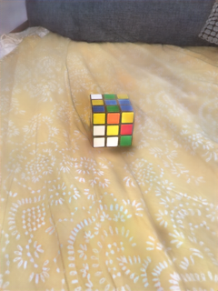

# Ambient Lighting Generation for Flash Images with Guided Conditional Adversarial Networks

### [Paper](https://arxiv.org/pdf/1912.08813.pdf)

To cope with the challenges that low light conditions produce in images, photographers tend to use the light provided by the camera flash to get better illumination. Nevertheless, harsh shadows and non-uniform illumination can arise from using a camera flash, especially in low light conditions. Previous studies have focused on normalizing the lighting on flash images; however, to the best of our knowledge, no prior studies have examined the side-way shadows removal, reconstruction of overexposed areas, and the generation of synthetic ambient shadows or natural tone of scene objects. To provide natural illumination and ensure the generation of high-frequency details on flash images, we propose a generative adversarial network in a guided conditional mode. We define an attention mechanism to guide the reconstruction loss, and an adversial loss to ensure high-frequency details. We show that this approach not only generates natural illumination but also attenuates harsh shadows, simultaneously generating synthetic ambient shadows. Our approach achieves promising results on a custom FAID dataset. We also analyze the components of our proposal and how they affect the overall performance and discuss the opportunities for future work.


## Qualitative results

| Flash image | Synthetic ambient image | Ambient image |
|:---:|:---:|:---:|
||||
||||
||||

## Prerequisites

* Linux
* Python 3.6.8
* PyTorch 1.2.0
* NVIDIA GPU + CUDA CuDNN

## Getting started

### Installation

* Clone this repo

```
git clone https://github.com/jozech/flash-to-ambient.git
cd flash-to-ambient
```
* Download the dataset virtual environment

```
python download_database.py
```

If you have problems with the script above, you can download it [here](https://drive.google.com/file/d/15ycOOjjOJ4KkwubC7g8Ttc5OvzClzM1C/view?usp=sharing), then click on the download button. If you use the external URL, you have to put the *'DATASET_LR'* folder inside a directory called *'datasets'*. The dataset is a reduced set of [FAID](http://yaksoy.github.io/faid/) because in the entire FAID there are ambient images with low illumination, artifacts, etc. All images were reduced to 320x240 resolution for our experiments.

     ├─ flash-to-ambient/
     ├─ datasets/
     ├─ DATASET_LR/ 
     ├─ train.py
     ├─ test.py
     ├─ download_database.py
     ├─ imgs/
     ├─ models/
     ├─ tools/
     └─ options/

* You can generate the results for the test dataset, for 1000 epochs of training.
```
python download_model.py
python test.py --load_epoch=1000
```

* Train our model, with default hyperparameters.
```
python train.py
```

* Train our model, and save the model every 50 epochs.
```
python train.py --save_epoch=50
```
* To evaluate one image
```
python evalM_oneimg.py --sample_dir=FILENAME
```

If you want to know more about the hyperparameters, see *options/base.py*.

